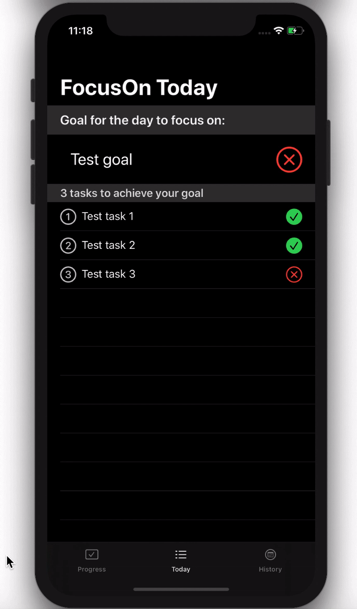

#  OpenClassrooms - iOS developer path - Project 7
## FocusOn, an app that helps you focus on the most important task of the day
<b>Tech:</b>  
XCode 11.6  
iOS 13.4  
SwiftUI  
CoreData  
Animations  
Combine  
Local notifications 
Dark mode supported  
Unit/UITests -> work in proggress

<b>Overview</b>  
Every morning, the app will ask the user to write down a single goal for the day and the 3 tasks that will help them achieve it. 
 
If the goal from the previous day was not achieved, it will be offered for the current day. 
 
Tasks and goals can be modified during the day. Only the most recent modification  for each day will be stored. 
 
The user will receive scheduled check-ins from the app asking them to mark the task’s progress. 
 
When the user completes one of the tasks, the app will perform a small "congrats" animation. When the user marks the goal as "achieved", the app will mark all of the tasks as  "completed" and will perform a more impressive "congrats" animation. If the user completes all of the tasks, the app will automatically mark the goal as "completed", but it will also  provide the user with the option to mark the goal as "not yet achieved". 
 
### Light Mode

### Dark Mode

